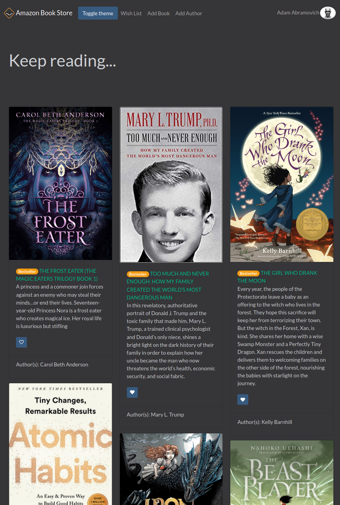
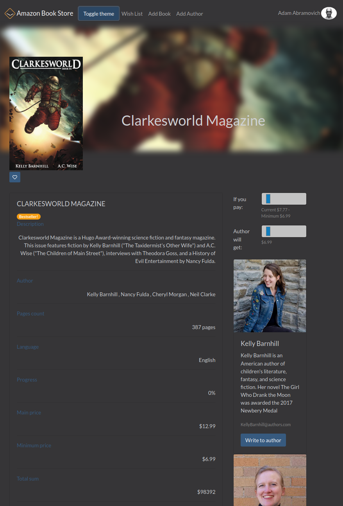
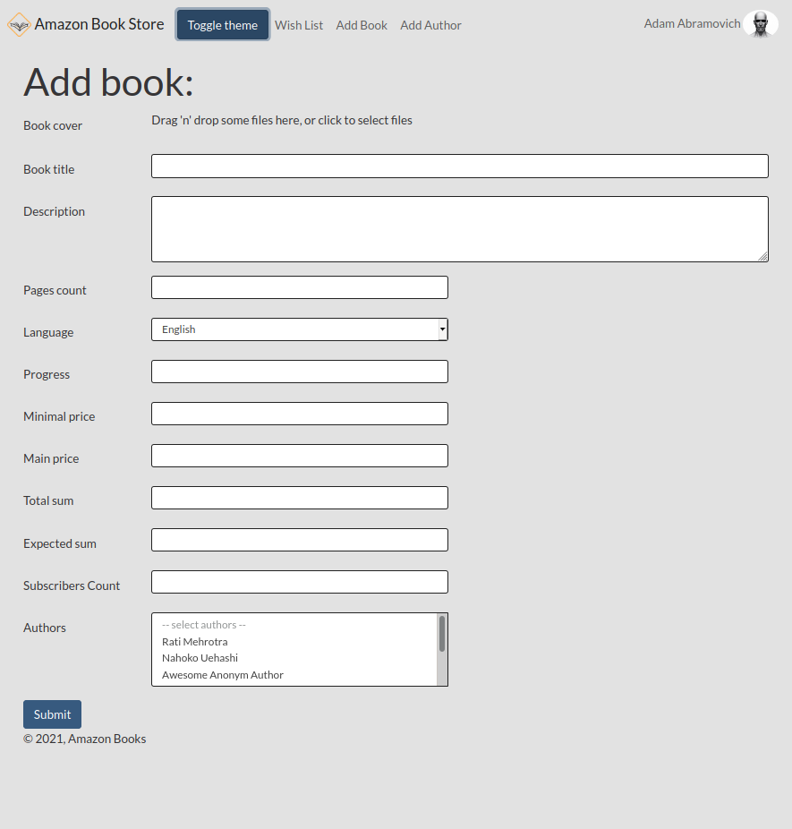
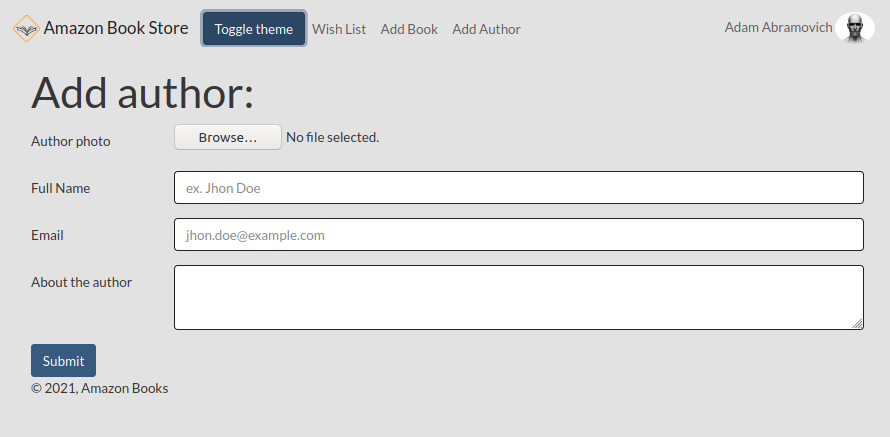

# Amazing Book Store

A book preview and selling functionality.

Used:
- React
- React-router
- React-helmet - manage changes to the document head
- Styled-components 
- Formik
- Yup - schema builder for value parsing and validation
- Axios
- React-Bootstrap
- React-Dropzone - drag&drop functionality
- SSR
- Jest - testing library
- Airtable API

